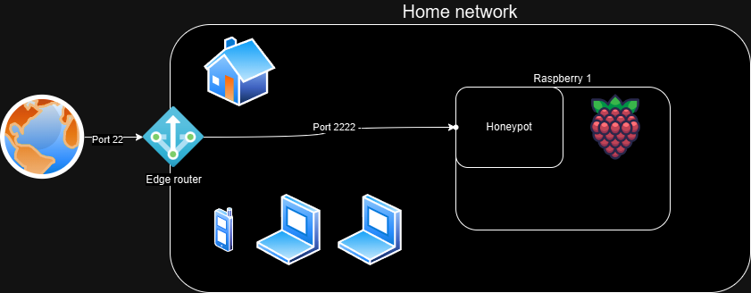

Hello there! Today I will try to explain to myself (and potentially others) how I configured a simple SSH honeypot. :honey_pot:
[Rubber Duck Debugging](https://rubberduckdebugging.com/) anyone?

---

## :checkered_flag: Goals

- Get an SSH honeypot up and running, exposed to the internet
- Have the ability to reliably capture events based on attempted sign-ins

---

## :cherries: Raspberry Pi

Let's get ready to rumble! Time to dust off the old Raspberry Pi and see if she’s still got it (*spoiler*: she barely held together).

So, let's get all the players out on the table. In the forward position, we find the veteran `Raspberry Pi 1 B+` ("P1"), who brings to the field:

{:height="36x" width="36x"}

- 10 years of experience (released in 2014)
- 512 MB RAM
- Broadcom 700 MHz processor
- 32-bit ARMv6 architecture
- SD card with 128GB (upgraded in 2023)

Now, this is not the first rodeo for the P1. She has been used and thrown away before, but is now ready to stay on (or so we hope).

Anyway, I've hosted a [Cowrie honeypot](https://cowrie.readthedocs.io/en/latest/) before, but getting useful and fun information out of it has been frustrating. The two reasons are 1) the ARMv6 architecture, and 2) the slow performance of the processor. The architecture limits possibilities due to most software not supporting it, most notably the [Elastic stack](https://github.com/vrince/arm-beats) and Docker components, since Cowrie uses a 64-bit architecture. Also, actually running something like Elastic, Logstash, and Kibana along with the rest of the services would be quite demanding for the old gal.

---

## :cow: Cowrie

In the back of the field, we have [`cowrie`](http://github.com/cowrie/cowrie/), which is a Telnet and SSH honeypot that can be used to collect and investigate how attackers try to gain access, escalate privileges, and perform actions on objectives.

To start with, all we want to do is set it up—**not actually allowing the attackers to successfully authenticate**—to see how many flies we can catch with the honey. The honeypot can be configured to respond to commands and provide a fake filesystem for the threat actor to taget. There are some really cool features where you can replay attackers, but we'll get to that eventually.

---

## :satellite: Network Design

My previous job was as a network engineer, and he would be mad if he saw this "network design"—i.e., a flat network. There used to be a segmented network with a Cisco Firepower acting as the barrier, but that requires work (and money) to maintain. So, once I moved to a new apartment, let's just say I went the lazy route.

So, the so-called "design":
- The edge router has a NAT rule configure d to translate port TCP/22 (if you want to know how the port was allocated back in the day, please read [this story](https://www.ssh.com/academy/ssh/port)—it's surprisingly short).
- Cowrie is configured to listen on port 2222 so that we can continue to use 22 for normal SSH comms. We are not looking at Telnet.




The config file, `cowrie.cfg` now looks like this:
```sh
[telnet]
enabled=no
```

---

## :wrench: Configuration time!

This is what all we tech nerds are waiting for—hands on keyboard, typing into all those .cfg files!

Cowrie is surprisingly easy (cheers, Michel!) to get up and running with a **simple** setup. I'm not going to pretend I understand the inner workings of the system, but built with Python to emulate a UNIX shell, we are just a few clicks away from deployment.

I'm not going to rehash the steps in [the guide](https://cowrie.readthedocs.io/en/latest/INSTALL.html#) to install dependencies and Cowrie itself.

I added a hostname and set SSH to use old settings, because why not?

The updated `cowrie.cfg` now looks like this:

<details markdown="1">

<summary>cowrie.cfg</summary>

```sh
[telnet]
enabled=no

[ssh]
ciphers = 3des-cbc,aes128-ctr
macs = hmac-md5,hmac-sha1
version = SSH-2.0-OpenSSH_6.0
public_key_auth = ssh-rsa,ssh-dss


[honeypot]
hostname=osl-centralstation-003
```

</details>

---

### Logs and events 

My last attempts at getting logs reliably out of Cowrie did not end very well. Since ELK didn't like the CPU, hosting it on the gaming PC worked, but since it isn’t running 24/7, data will get dropped unless we have some kind of queuing. There were many solutions that could have solved this, but the best contender to fix it was our old friend `rsyslog`. I thought that would be the end of all problems, but due to (what I *believe* was) a bug, I abandoned that project.

Picking up the issue again, I was determined to use a tried and tested system—namely SQL. I've had little hands-on experience with SQL, so I thought it would be a good idea. Now, I could just host an local instance of [`MariaDB`](https://mariadb.org/), right? Well, why make it too simple? I decided to host the DB on another server in my local network.

After setting up the DB, we now need to update the config:


<details markdown="1">

<summary>cowrie.cfg</summary>

```sh
[telnet]
enabled=no

[ssh]
ciphers = 3des-cbc,aes128-ctr
macs = hmac-md5,hmac-sha1
version = SSH-2.0-OpenSSH_6.0
public_key_auth = ssh-rsa,ssh-dss

[honeypot]
hostname=osl-centralstation-003

[output_mysql]
host = LOCAL_IP
database = cowrie
username = cowrie
password = PASSWORD
port = 3306
debug = false
enabled = true
```

</details>

---

### SQL

We now have a few tables:

```txt
+------------------+
| Tables_in_cowrie |
+------------------+
| auth             |
| clients          |
| downloads        |
| input            |
| ipforwards       |
| ipforwardsdata   |
| keyfingerprints  |
| params           |
| sensors          |
| sessions         |
| ttylog           |
+------------------+
```

We now have the following data:
- **Logs** `$HOME/cowrie/var/log/cowrie/cowrie.log`
- **Events** in MariaDB

It does not take many seconds before events start pouring in—over 1,600 attempts in the last hour.

## :gift: Sharing Threat Intel

Now that we are receiving attacks from coin miners, researchers, botnets, worms—you name it—we should share this data with someone, right?

Yes, we should, and Cowrie has a number of built-in third-party solutions. Personally, I love [AbuseIPDB](https://www.abuseipdb.com/)!

What I want to do is share all this valuable intel with the world, and it's really simple:


<details markdown="1">

<summary>cowrie.cfg</summary>

```sh
[telnet]
enabled=no

[ssh]
ciphers = 3des-cbc,aes128-ctr
macs = hmac-md5,hmac-sha1
version = SSH-2.0-OpenSSH_6.0
public_key_auth = ssh-rsa,ssh-dss

[honeypot]
hostname=osl-centralstation-003

[output_mysql]
host = LOCAL_IP
database = cowrie
username = cowrie
password = PASSWORD
port = 3306
debug = false
enabled = true

[output_abuseipdb]
enabled = True
api_key = API_KEY
rereport_after = 24
#tolerance_window is in minutes
tolerance_window = 120
tolerance_attempts = 2
# WARNING: A binary file is read from this directory on start-up. Do not
# change unless you understand the security implications!
dump_path = ${honeypot:state_path}/abuseipdb

```

</details>


Threat actor IPs are now shared with the world!


---

# Conclusion

Setting up Cowrie is pretty simple, and seeing the results is well worth any pain! {:height="15x" width="15x"}

I'm not going to lie—trying (and failing) to get Docker, ELK, and rsyslog++ up and running smoothly took a considerable amount of time, but focusing on a less complicated solution was easier (who would have thought, huh?).

I've also been looking at the data and thinking about what fun I can have with it, but I'll leave that for another time. :wave: